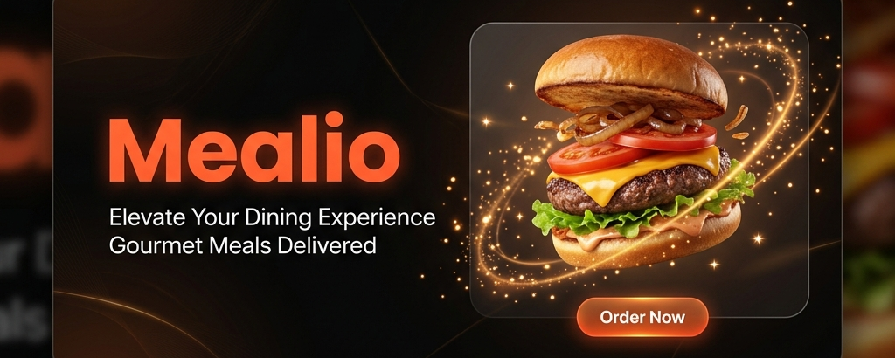

<div align="center">
  
</div>

# 🔥 Mealio — Dark Gourmet Food Delivery
### A full-stack food ordering platform with real-time order tracking and mock payment


## 📸 Screenshots
*(Coming soon: Drop your screenshots into the `assets` folder!)*
<!-- 
Uncomment these lines once you take the screenshots:


-->

```
Vite + React + TypeScript  ──►  Zustand Stores  ──►  Supabase Auth  ──►  PostgreSQL DB
        ↓                              ↓                    ↓                   ↓
   Framer Motion               Cart Persistence        Google OAuth         RLS Policies
   Anime.js                    Real-time Sync         Email + Password      Realtime Orders
   Glassmorphism               Mock Razorpay           Auto Profiles        Row-Level Security
```

</div>

---

## 📖 Overview

**Mealio** is a production-ready food delivery web app built with a dark gourmet aesthetic. It goes far beyond a typical frontend prototype — featuring real Supabase authentication, a live PostgreSQL database, Supabase Realtime order tracking, and a fully animated mock payment flow that mirrors the Razorpay experience.

The design philosophy: every interaction should feel premium. Glassmorphism cards, Framer Motion page transitions, Anime.js micro-animations, and a hand-crafted dark color system make the UI feel alive.

---

## ✨ Features

### 🎨 Frontend
- **Dark Gourmet UI** — custom design system with glassmorphism, radial gradients, and neon accents
- **Framer Motion** — page transitions, card reveals, staggered list animations
- **Anime.js** — cart badge pulse, card shake on auth error, add-to-cart ripple
- **Hybrid Menu** — loads instantly from static data; silently refreshes from the DB in background
- **Cart Drawer** — slide-in cart with live totals, Zustand-persisted to localStorage
- **Responsive** — full mobile + desktop layout

### 🔐 Authentication
- **Email + Password** sign up / sign in via Supabase Auth
- **Google OAuth** — one-click sign-in with Google
- **Auto Profile Creation** — a Postgres trigger auto-creates a `profiles` row on every new signup
- **Session Persistence** — auth state survives page refresh via Supabase session listener

### 🍽️ Menu & Cart
- **48 menu items** across 12 cuisine categories (North Indian, Biryani, Coastal, Chinese, Italian, and more)
- **Filters** — category, veg/non-veg, price range, search, and sort (popular / rating / price)
- **Zustand cart store** with `persist` middleware — cart survives browser refresh
- All existing components continue to work via backward-compatible `useCart()` / `useAuth()` shims

### 💳 Mock Razorpay Payment
- Realistic payment modal matching Razorpay's dark blue UI
- Card number auto-formatting (groups of 4), expiry MM/YY, CVV
- Animated 3-stage flow: **Processing → Verifying with bank → Confirmed / Declined**
- **Test card:** `4111 1111 1111 1111` → success. Any other card → shake animation + failure state
- On success → real `INSERT` into Supabase `orders` table

### 📦 Orders & Realtime Tracking
- Order placed → saved to `orders` + `order_items` tables with a full price snapshot
- `/order/:id` page with a **live timeline**: Placed → Confirmed → Preparing → Out for Delivery → Delivered
- **Supabase Realtime** subscription — status updates in the DB reflect instantly on the tracking page without a refresh
- Test by running `UPDATE public.orders SET status = 'preparing' WHERE id = '...'` in the Supabase SQL editor

### 👤 Profile Page
- View and edit name + phone number
- Full order history with status badges
- One-click link back to each order's tracking page
- Secure — Row Level Security ensures users can only see their own data

---

## 🏗️ Tech Stack

| Layer | Technology | Purpose |
|---|---|---|
| **Frontend framework** | React 18 + Vite 5 | SPA with fast HMR |
| **Language** | TypeScript 5 | End-to-end type safety |
| **Styling** | Vanilla CSS + custom design tokens | Dark gourmet theme |
| **Animations** | Framer Motion + Anime.js | Page transitions + micro-animations |
| **State management** | Zustand + `persist` middleware | Auth + cart, survives refresh |
| **Backend / DB** | Supabase (PostgreSQL) | Tables, RLS, Auth, Realtime |
| **Authentication** | Supabase Auth | Email/password + Google OAuth |
| **Realtime** | Supabase Realtime (postgres_changes) | Live order status updates |
| **Payment** | Mock Razorpay (custom component) | Realistic payment simulation |
| **Icons** | Lucide React | Consistent icon set |
| **DB client** | `pg` (Node.js) | Migration + seed scripts |

---

## 🗄️ Database Schema

```
auth.users (Supabase managed)
    │
    ▼ (auto-trigger on signup)
profiles          addresses
    │
    ▼
orders ──────────► order_items
    │
    ▼ (Realtime subscription)
OrderTrackingPage

categories ◄──── menu_items
```

| Table | Rows | Description |
|---|---|---|
| `profiles` | 1 per user | Auto-created on signup. Stores name, email, phone, avatar |
| `addresses` | 0–many per user | Saved delivery addresses with default flag |
| `categories` | 12 | Cuisine categories seeded from `backend/migrate.ts` |
| `menu_items` | 48+ | All dishes — editable from Supabase dashboard |
| `orders` | 1 per checkout | Status, totals, address snapshot, payment info |
| `order_items` | N per order | Price snapshot — not affected if item is later edited |

### Row Level Security
Every table has RLS enabled. Users can **only** read or modify their own rows:
- `profiles` → `auth.uid() = id`
- `addresses`, `orders`, `order_items` → scoped to `user_id`
- `categories`, `menu_items` → public read (anyone can browse the menu)

---

## 📁 Project Structure

```
mealio/
├── backend/
│   ├── migrate.ts              # All-in-one: schema + seed via direct PG connection
│   ├── schema/
│   │   ├── 01_tables.sql       # CREATE TABLE statements
│   │   ├── 02_rls.sql          # Row Level Security policies
│   │   └── 03_functions.sql    # Profile trigger + updated_at + Realtime enable
│   ├── seed/
│   │   └── seed.ts             # Seed script (alternative to migrate.ts)
│   └── types/
│       └── database.types.ts   # TypeScript types for all DB tables
├── src/
│   ├── components/
│   │   ├── cart/               # CartDrawer, CartItem
│   │   ├── food/               # FoodCard
│   │   ├── layout/             # Header, Footer
│   │   ├── payment/            # MockRazorpayModal ✨
│   │   ├── ui/                 # Button, Card, Input
│   │   └── visual/             # ParticleCanvas, animations
│   ├── context/                # Thin shims (re-export from stores)
│   ├── data/
│   │   └── menu.ts             # Static menu (instant load fallback)
│   ├── pages/
│   │   ├── HomePage.tsx
│   │   ├── MenuPage.tsx        # Hybrid static+DB fetch
│   │   ├── CartPage.tsx        # Checkout with mock payment
│   │   ├── LoginPage.tsx       # Real Supabase auth + Google OAuth
│   │   ├── SignupPage.tsx      # Real Supabase auth + Google OAuth
│   │   ├── OrderTrackingPage.tsx  # Realtime live tracking ✨
│   │   └── ProfilePage.tsx     # Edit profile + order history ✨
│   ├── store/
│   │   ├── useAuthStore.ts     # Supabase Auth + Zustand
│   │   ├── useCartStore.ts     # Cart with localStorage persistence
│   │   └── useUiStore.ts       # Cart drawer open/close
│   ├── lib/
│   │   └── supabase.ts         # Typed Supabase client
│   └── types/
│       └── index.ts            # Domain types (MenuItem, CartItem, etc.)
├── .env.example                # Safe template — copy to .env and fill values
├── .gitignore                  # .env files excluded
└── package.json
```

---

## 🚀 Getting Started

### 1. Clone & Install
```bash
git clone https://github.com/SURAJMUDRAKOLA/mealio.git
cd mealio
npm install
```

### 2. Set up environment variables
```bash
cp .env.example .env
```
Fill in your Supabase credentials in `.env` (get them from Supabase Dashboard → Settings → API).

### 3. Run the database migration
```bash
npx tsx backend/migrate.ts
```
This creates all tables, applies RLS policies, sets up triggers, and seeds 48 menu items.

### 4. Enable Google OAuth *(optional)*
In Supabase Dashboard → Authentication → Providers → Google, enable Google and set the redirect URI to:
```
https://YOUR_PROJECT_REF.supabase.co/auth/v1/callback
```

### 5. Start the dev server
```bash
npm run dev
```
Visit `http://localhost:5173`

---

## 🧪 Testing the Payment Flow

1. Add items to cart → proceed to checkout → click **Pay**
2. Enter test card: **`4111 1111 1111 1111`**, any expiry, any CVV
3. Watch the animated processing stages
4. Order is saved to Supabase and you're redirected to live tracking

To simulate delivery, run in Supabase SQL Editor:
```sql
UPDATE public.orders SET status = 'confirmed'        WHERE id = 'your-order-id';
UPDATE public.orders SET status = 'preparing'        WHERE id = 'your-order-id';
UPDATE public.orders SET status = 'out_for_delivery' WHERE id = 'your-order-id';
UPDATE public.orders SET status = 'delivered'        WHERE id = 'your-order-id';
```

---

## 🌐 Environment Variables

| Variable | Required | Description |
|---|---|---|
| `VITE_SUPABASE_URL` | ✅ | Your Supabase project URL |
| `VITE_SUPABASE_ANON_KEY` | ✅ | Supabase publishable (anon) key |
| `DATABASE_URL` | For migrate script | Direct PostgreSQL connection string |
| `SUPABASE_SERVICE_ROLE_KEY` | For seed script | Service role key (bypasses RLS) |

---

<div align="center">

Made with ❤️ by [Suraj Mudrakola](https://github.com/SURAJMUDRAKOLA)

</div>
